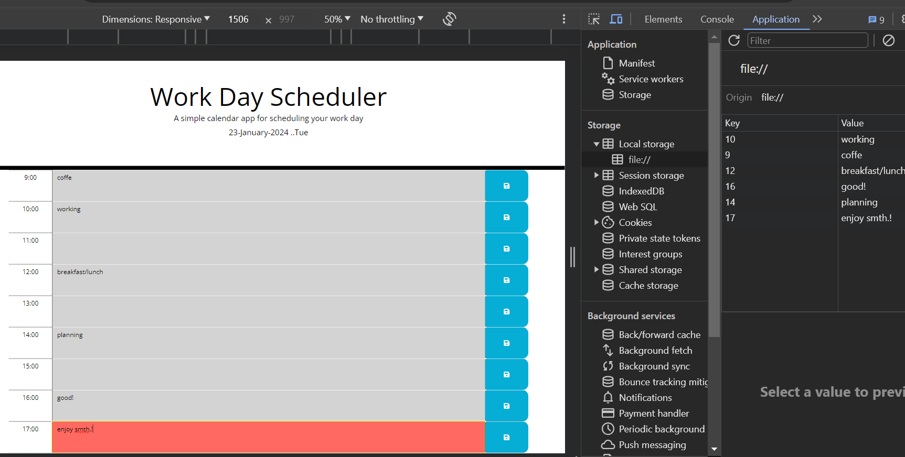

# Daily-Work-Planner-App

## Description
 It is a overview about a work day scheduler that provides access to a simple calendar application.
 This simple calendar application allows users to create and manage daily schedules by saving events for each hour of the workday. It provides a visual overview of the day's events and helps users stay organized and efficient.
 Features:
-The current day is prominently displayed at the top of the calendar for easy reference;
-Standard business hours (9 AM to 5 PM) are divided into clear timeblocks for structured event planning;
-Users can easily add events by clicking on a timeblock and entering text in the provided input field;
-Events are saved vin lcal storage and persisted between page refreshes using local storage, ensuring data continuity;
-Past, present, and future timeblocks are visually distinguished using color-coding for quick visual comprehension.
-When refresh page, saved events persists!

## Table of Contents (Optional)

## Installation
Technologies Used:
-HTML: structures the basic layout and content of the application;
-CSS: styles the visual appearance and responsiveness of the calendar;
-JavaScript: powers the dynamic functionality of the app, including: event handling, data manipulation, local storage interactions;
-jQuery: implifies DOM manipulation and event handling;
-Day.js: provides a lightweight and performant library for working with dates and times!
Getting started:
-Clone or download the project repository;
-Open the index.html file in your web browser;
-Start adding events to your daily schedule!
The app from my example is available at https://andreea-lita.github.io/Daily-Work-Planner-App/ !

## Usage

Provide instructions and examples for use. Include screenshots as needed.

To add a screenshot, create an `assets/images` folder in your repository and upload your screenshot to it. Then, using the relative filepath, add it to your README using the following syntax:

    ```md

    ```

## Credits
https://www.w3schools.com/icons/tryit.asp?filename=tryicons_fa-save 
https://www.programiz.com/javascript/if-else
https://stackoverflow.com/questions/12481439/jquery-this-keyword 
https://www.chegg.com/homework-help/questions-and-answers/

## License
MIT License

## Features
-Displays current day;
-Presents timeblocks;
-Color-codes timeblocks;
-Allows event entry;
-Saves events in local storage;
-Displays events between refreshes!

## How to Contribute
Next Steps:
-improve UI/UX: Enhance the visual design and user experience of the calendar.
-explore advanced features: consider adding features like: recurring events, drag-and-drop event rescheduling, integration with external calendars
-address accessibility: ensure the application is usable for individuals with diverse abilities.
-conduct user testing: gather feedback from users to refine the app's functionality and design, maybe using recent variant of jquery and dayjs like:<script src="https://code.jquery.com/jquery-3.6.4.min.js"></script>, <script src="https://cdn.jsdelivr.net/npm/dayjs@1.11.4/dayjs.min.js"></script>

## Tests

Go the extra mile and write tests for your application work. Then provide examples on how to run them here.
<script src="https://code.jquery.com/jquery-3.6.4.min.js"></script>
<script src="https://cdn.jsdelivr.net/npm/dayjs@1.11.4/dayjs.min.js"></script>